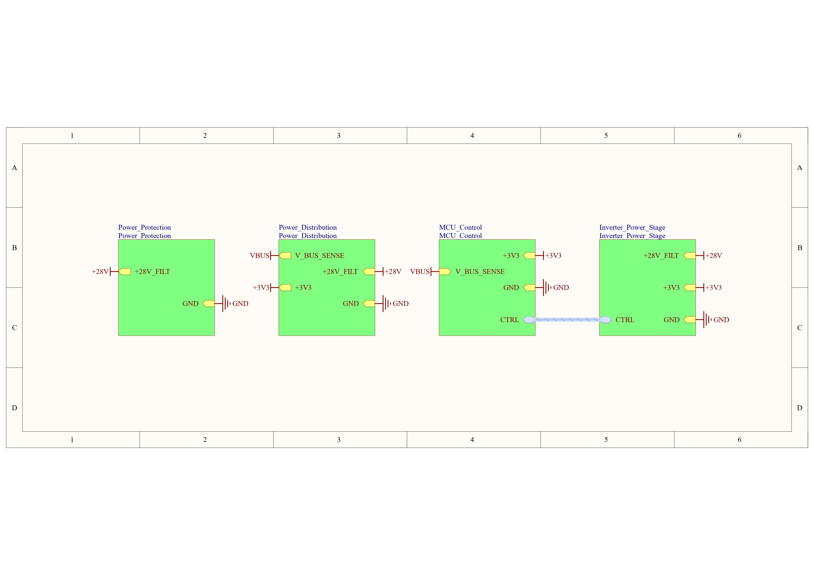
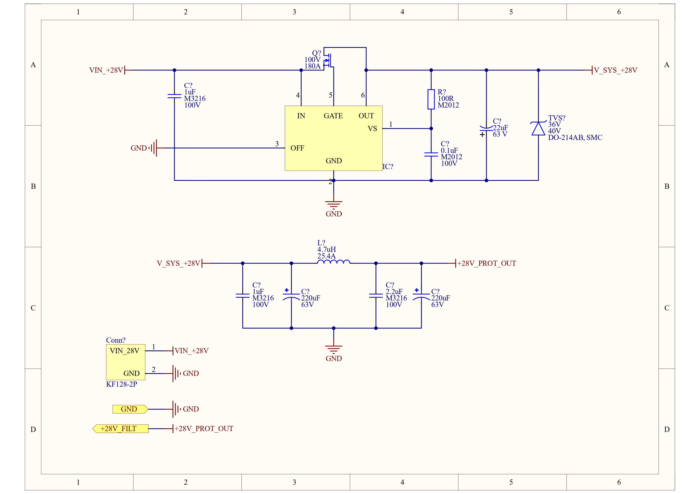
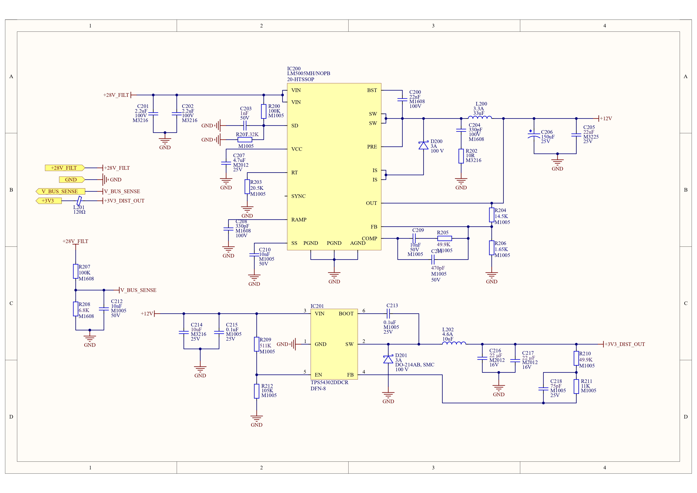
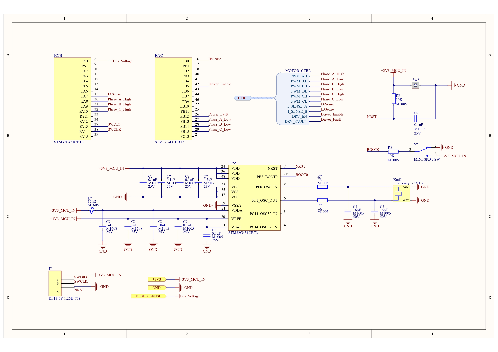
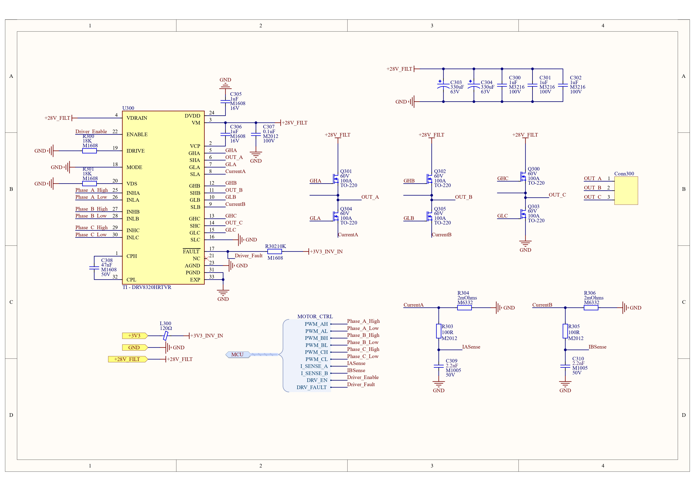

# 🚀 MIL-STD-461G Compliant BLDC Motor Driver

This project is a hardware design for an industrial/military-grade Brushless DC (BLDC) Motor Driver, engineered to operate under harsh environmental conditions and meet strict electromagnetic compatibility (EMI/EMC) requirements (MIL-STD-461G).

The project was built from scratch using Altium Designer with a **Strict Hierarchical** design methodology. The schematic design is currently 100% complete, and the project is moving into the **PCB Layout** phase.

---

## 📐 System Architecture and Schematic Design (Strict Hierarchy)

To maximize maintainability and fault isolation, the system is divided into 4 main sub-blocks and 1 Top Sheet (5 Sheets total):

### 1. Main Sheet (Top Level)
The bird's-eye view of the system. This is the main backbone where power and signal buses (Harness & Bus) are securely routed between blocks.
> *(Insert Main Sheet image here)*

### 2. Power Protection
The system's first line of defense. Reverse polarity, overvoltage, and EMI input filtering are handled in this layer.
* **Design Decision:** Instead of a standard power diode, an **LM5050MK-1 Ideal Diode Controller** paired with an N-Channel MOSFET was used for reverse polarity protection. This prevents massive heat dissipation (Power Loss = I²R) and voltage drops at high currents.
> *(Insert Power Protection image here)*

### 3. Power Distribution
The layer where the 28V main bus voltage is stepped down in stages for the digital and analog units.
* **Design Decision:** The regulation process is split into two stages: `28V -> 12V (LM5005)` and `12V -> 3.3V (TPS54302)`. This distributes the thermal load of the step-down (Buck) converters and minimizes switching noise.
> *(Insert Power Distribution image here)*

### 4. MCU Control (Digital Brain)
At the heart of the system is the **STM32G431CBT3**, specifically designed for motor control algorithms (such as FOC).
* **Design Decision:** Instead of using an external Current Sense Amplifier (CSA), the hardware **OPAMPs and PGA (Programmable Gain Amplifier)** modules of the STM32G4 series were utilized. Phase currents (IASense, IBSense) are routed directly to the MCU's OPAMP inputs (e.g., PA7, PB0), reducing both BOM cost and signal latency.
* **EMI Filtering:** A **Murata BLM Series Ferrite Bead** was added directly to the MCU's 3.3V supply input. Combined with bypass capacitors, this creates an LC filter that effectively blocks high-frequency noise generated by the Inverter's MOSFETs from reaching the digital brain.
> *(Insert MCU Control image here)*

### 5. Inverter Power Stage
The layer with high currents and high switching speeds where the motor is physically driven.
* **Hardware:** Texas Instruments **DRV8320HRTVR** smart gate driver and **CSD18532KCS** (100A rated) power MOSFETs.
* **Design Decision (Capacitors vs. Snubbers):** Initial plans for direct capacitor connections at the phase outputs were removed to avoid massive current spikes (shoot-through effect). Instead, empty pads were left for an **RC Snubber** infrastructure, designed to dampen switching ringing and EMI emissions.
> *(Insert Inverter Power Stage image here)*

---

## ⚙️ Key Engineering Decisions

Critical steps taken during the design process to meet industrial and military standards:

1. **Star Grounding & Net Tie:**
   To prevent the "Ground Bounce" noise caused by massive switching currents from corrupting the MCU's sensitive analog measurements (millivolt-level current readings), the Analog Ground (`AGND`) and Power Ground (`PGND`) were separated at the schematic level. These two domains are connected solely through a single **Net Tie (NT400)** located in the MCU stage.
2. **Connector Selection:**
   Due to high vibration and current requirements, standard headers were avoided. **32A rated Phoenix Contact (MKDS 5 series)** screw terminals were selected for motor phase outputs, and locked, anti-vibration connectors were chosen for the debugging (SWD) line.
3. **Block Numbering (Professional Annotation):**
   All components in the schematic are numbered by page block for easy troubleshooting and modular readability (e.g., the Protection stage is the 100 series, the Inverter stage is the 400 series).
4. **Signal Integrity:**
   Complex power net naming conflicts (Multiple Net Names) caused by the Strict Hierarchy in Altium Designer were unified. This prevents physical isolation issues during polygon pours and ensures zero compiler warnings. `[Info] Compile successful, no errors found.`

---

## 🚀 Current Status and Next Steps

✅ **Component Selection (BOM):** Complete.
✅ **Hierarchical Schematic Design:** 100% Complete and Electrical Rule Check (ERC) verified.
⏳ **PCB Layout & Routing:** **IN PROGRESS.**
   * Component Placement
   * Polygon Pours for high-current paths
   * Routing of differential pairs and sensitive analog traces
   * Via Stitching for Thermal Management
